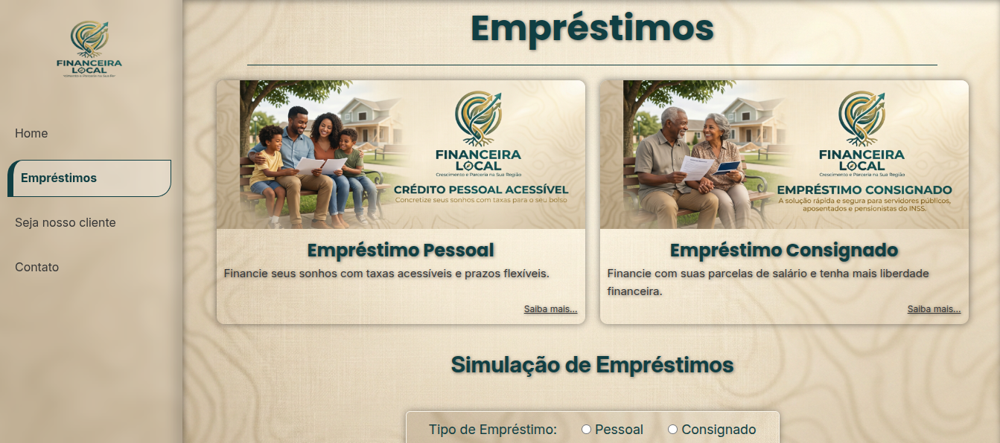

# 💰 Financeira Local

Site institucional de uma financeira local que oferece **empréstimos**, **financiamentos** e **antecipação de recebíveis**. Projeto desenvolvido como parte das **Atividades 1 e 2** da UC 13 — Codificação de Páginas Web (HTML5 e CSS3).

---

## 📸 Preview

| Home | Empréstimos | Seja nosso cliente |
|---|---|---|
|  |  |  |

---

## 🎯 Sobre o projeto

O site foi construído a partir dos **wireframe's desenvolvidos na Atividade 1** (Proposta 1 — Financeira Local). O objetivo é apresentar os serviços da empresa de forma clara, profissional e visualmente atrativa, transmitindo **confiança**, **credibilidade** e **proximidade** com o cliente.

| Home | Empréstimos | Seja nosso cliente |
|---|---|---|
|  |  |  |


Além dos requisitos obrigatórios, o projeto inclui **funcionalidades extras** como:
- Simulação de empréstimo com cálculo de parcela em tempo real
- Máscara de moeda (R$) nos inputs de valor
- Animação de "ticket saindo da máquina" no resultado da simulação
- FAQ expansível com animação do ícone
- Validações de formulário com feedback visual
- Botão "voltar ao topo" com rolagem suave
- Máscara de telefone com DDD

---

## 🛠️ Tecnologias utilizadas

| Tecnologia | Uso |
|---|---|
| **HTML5** | Estrutura semântica |
| **CSS3** | Grid, Flexbox, variáveis CSS, animações, `backdrop-filter` |
| **JavaScript (ES6+)** | Módulos, validações, máscaras, interações |
| **Font Awesome 6.5.1** | Ícones via CDN |
| **Google Fonts** | Poppins (títulos) + Inter (corpo) |
| **Git** | Versionamento |
| **Figma** | Wireframes (Atividade 1) |

---

## 🎨 Identidade visual

- **Paleta**: verde-escuro (`#073d41`) + bege (`#FAF6ED`)
- **Tipografia**: Poppins (títulos) + Inter (corpo do texto)
- **Efeito de vidro (glassmorphism)**: aplicado em cards, navbar e formulário
- **Background**: textura sutil de madeira clara, com `background-size: cover`
- **Imagens**: banners gerados por IA, temáticos para cada serviço

---

## 📁 Estrutura do projeto

```
Financeira-Local/
├── index.html                              # Página inicial (Home)
├── wireframe/                              # Wireframe's originais (Atividade 1)
│   ├── home.png
│   ├── emprestimos.png
│   └── seja-nosso-cliente.png
├── src/
│   ├── assets/
│   │   ├── favicon/
│   │   │   └── favicon.ico
│   │   └── img/
│   │       ├── background.jpeg             # Background global
│   │       ├── banner-seja-cliente.jpeg    # Banner da página cliente
│   │       ├── emprestimos-card.jpeg       # Card da Home
│   │       ├── financiamento-card.jpeg     # Card da Home
│   │       ├── antecipacao-de-recebiveis-card.jpeg
│   │       ├── banner_1_emprestimo-pessoal.jpeg
│   │       ├── banner_2_emprestimo-consignado.jpeg
│   │       └── logo/
│   │           └── logo-512x512.png
│   ├── css/
│   │   ├── index.css                       # Importa todos os módulos CSS
│   │   ├── global.css                      # Reset, variáveis e estilos base
│   │   ├── utilidades.css                  # Classes utilitárias
│   │   ├── navbar.css                      # Menu lateral
│   │   ├── main.css                        # Conteúdo principal (Home)
│   │   ├── emprestimos.css                 # Estilos da página Empréstimos
│   │   ├── client.css                      # Estilos da página Cliente
│   │   └── footer.css                      # Rodapé
│   ├── js/
│   │   ├── index.js                        # Ponto de entrada
│   │   ├── initApp.js                      # Inicializa os scripts
│   │   ├── elements.js                     # Mapeamento de elementos do DOM
│   │   ├── utils.js                        # Funções utilitárias
│   │   ├── homeIndex.js                    # Scripts da Home
│   │   ├── pageEmprestimo.js               # Scripts da página Empréstimos
│   │   └── sejaCliente.js                  # Scripts da página Cliente
│   └── pages/
│       ├── emprestimos.html                # Página de Empréstimos
│       └── cliente.html                    # Página Seja nosso cliente
└── README.md
```

---

## 🧩 Funcionalidades por página

### 🏠 Home (`index.html`)
- **Hero** com título, subtítulo e botão "Simular agora"
- **Seção "Nossos Serviços"** com 3 cards (Empréstimos, Financiamentos, Antecipação de Recebíveis)
- Cada card com imagem, título, descrição e link "Saiba mais..."
- Botão **"Simular agora"** com animação e redirecionamento para a página de Empréstimos
- Botão **"Voltar ao topo"** que aparece ao rolar a página

### 💵 Empréstimos (`src/pages/emprestimos.html`)
- Cards com **Empréstimo Pessoal** e **Empréstimo Consignado**
- **Simulação de empréstimo**:
  - Tipo (radio: Pessoal / Consignado)
  - Valor desejado (com máscara de moeda em R$)
  - Prazo em meses
  - Botão "Calcular" com validações
  - Card de resultado com **animação de "ticket saindo da máquina"**
- **FAQ expansível** com 4 perguntas (animação do `+` girando para `×`)
- Botão **"Seja nosso cliente"** que aparece após o cálculo

### 👤 Seja nosso cliente (`src/pages/cliente.html`)
- **Banner** com imagem e texto descritivo
- **Formulário completo**:
  - Tipo de serviço (4 radio buttons)
  - Nome (com máscara de apenas letras)
  - E-mail (com validação de formato)
  - Telefone (com máscara `(XX) XXXXX-XXXX`)
  - Cidade (com máscara de apenas letras)
  - Mensagem (textarea)
  - Checkbox "Sou aposentado"
  - Botão "Cadastrar"
- **Mensagem de sucesso/erro** com feedback visual
- Limpeza automática do formulário após o envio

---

## ⚙️ Como rodar o projeto

### Opção 1 — Direto no navegador
1. Clone o repositório:
   ```bash
   git clone https://github.com/brunotxrs/Financeira-Local
   ```
2. Entre na pasta:
   ```bash
   cd Financeira-Local
   ```
3. Abra o `index.html` no navegador.

### Opção 2 — Com Live Server (recomendado)
1. Instale a extensão **Live Server** no VS Code.
2. Clique com o botão direito no `index.html` → **Open with Live Server**.

> ⚠️ **Importante**: como o projeto usa **ES Modules** (`<script type="module">`), abrir o HTML diretamente com `file://` pode causar erros de CORS. Use um servidor local (Live Server, `http-server`, Python `http.server`, etc.).

---

## 🏗️ Decisões técnicas

### Arquitetura CSS
- **Modularização**: cada parte do layout tem seu próprio arquivo (navbar, main, footer, etc.)
- **Variáveis CSS** (`:root`): cores, fontes, sombras e text-shadows centralizados
- **Classes utilitárias**: `.glass-effect`, `.box-shadow`, `.hidden`, `.clicked`, `.btn-all`, etc.
- **BEM-like naming** nos seletores mais complexos

### Arquitetura JavaScript
- **ES Modules**: cada responsabilidade em um arquivo (`elements.js`, `utils.js`, `homeIndex.js`, etc.)
- **Ponto de entrada único** (`index.js`) que importa o `initApp.js`
- **Funções auto-verificadas**: cada script checa se os elementos existem antes de usá-los
- **Reaproveitamento**: funções utilitárias em `utils.js` (máscaras, validações, mensagens)

### Acessibilidade
- `title` em links e ícones
- `aria-live` nas mensagens de erro/sucesso (a implementar)
- Uso de `<address>` para endereço
- `lang="pt-BR"` no HTML

### UX
- **Máscara de moeda** com `Intl.NumberFormat` (pt-BR)
- **Máscara de telefone** dinâmica (fixo/celular)
- **Feedback visual** em erros e sucessos
- **Animações suaves** com `transition` e `@keyframes`
- **Scroll suave** ao voltar ao topo

---

## 📜 Histórico de desenvolvimento

O projeto foi versionado com **Git** seguindo a convenção [Conventional Commits](https://www.conventionalcommits.org/):

| Tipo | Uso |
|---|---|
| `feat` | Nova funcionalidade |
| `fix` | Correção de bug |
| `style` | Mudanças de estilo/CSS |
| `refactor` | Refatoração sem mudança de comportamento |
| `chore` | Tarefas de manutenção |
| `docs` | Documentação |

Exemplos de commits:
```
feat(pageEmprestimos): script com todas as funções de simular empréstimos
feat(util.js): scripts utilitários reaproveitáveis em todo o site
feat(elements): script para export dos elementos das páginas
refactor(styles-footer): atribuindo user-select no dados para contatos
refactor(styles-emprestimos): removendo estilos onde foram aplicadas classes utilitárias
```

---

## 🎓 Contexto acadêmico

Projeto desenvolvido para a **UC 13 — Codificação de Páginas Web** do curso **Técnico em Desenvolvimento de Sistemas** (Tec_System_Developer).

- **Atividade 1**: Wireframe's no Figma (Proposta 1 — Financeira Local)
- **Atividade 2**: Desenvolvimento das páginas em HTML5 e CSS3

---

## 🚧 Próximos passos

- [ ] Responsividade (mobile-first)
- [ ] Acessibilidade (aria-labels, contraste, navegação por teclado)
- [ ] Testes em diferentes navegadores
- [ ] Integração com back-end (Atividade 3)
- [ ] Conexão com banco de dados

---

## 👤 Autor

**Bruno Teixeira**
- GitHub: [@brunotxs](https://github.com/brunotxrs)

---

## 📄 Licença

Projeto desenvolvido para fins **acadêmicos**. Todos os direitos reservados à Financeira Local (fictícia).